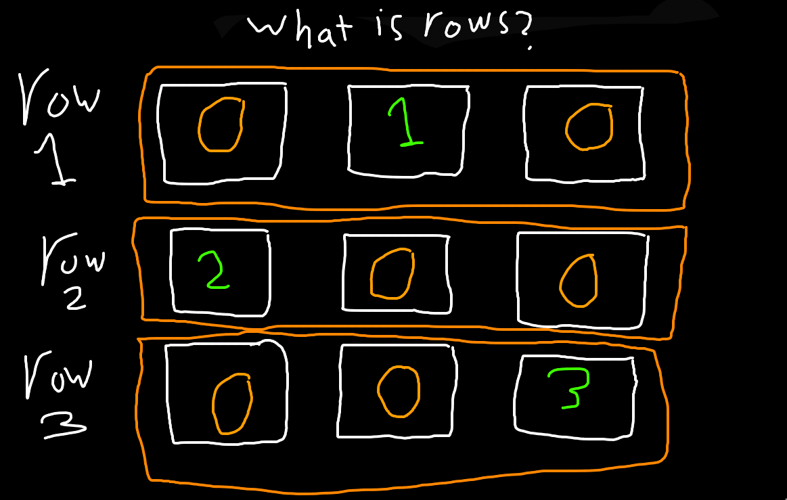
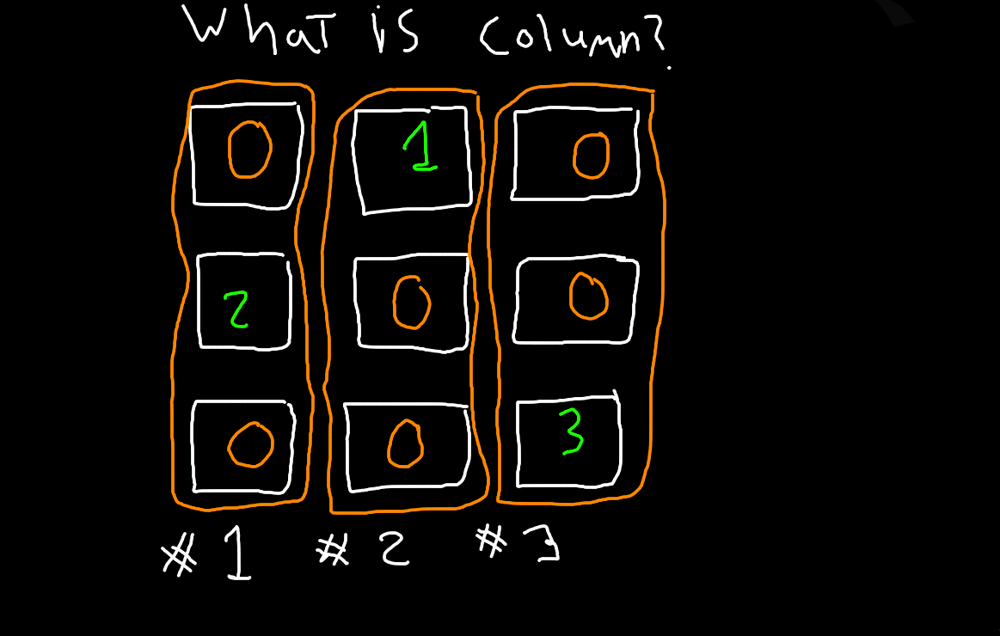
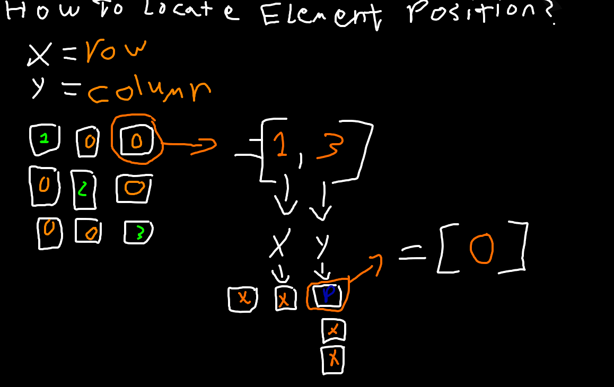
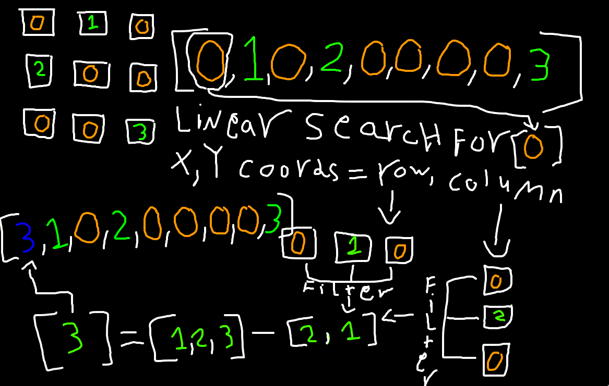

# some concepts you need to know before you understand how the Algorithm works
- what is rows?
- what is columns?
- what x,y refered for?
- how the Algorithm locate the item?
- how it know what number to put?

# what is rows?

# what is columns?

# what is x,y and how the Algorithm locate the item?

# now how it works?
- first it do linear search in Array that hold the numbers of the grid to locate number [0]
- after locating [0] it saves the index of [0] in variable then send it to function to get the x,y and the row & column
- then it start search in the [0] row for numbers for example let's say this is the row: [0,0,2] it will filter it to this [2]
- then it start to filter the column in example this is the column [0,3,0] so it will filter it to [3] then compaine the row output and column output
- to this [2,3] then it subtract this array from array that have the three numbers you can use in the game which is [1,2,3] so what we will get is
- [1] and this is the correct number we will use in the index and it do this proccess specific number times until it solve the game

# explain in draw

# i hope you like it guys :)
- if you liked my Algorithm share the repository link :)
